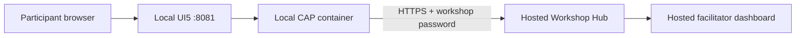

# Workshop Chat: 60-Minute Task Guide

This exercise improves a working UI5 and CAP chat application through seven tasks.
Each participant runs UI5 and CAP locally, while one facilitator-managed Workshop
Hub runs in the cloud for the whole room. Local CAP services send their activity to
that shared cloud URL. The Hub validates six coding tasks from real API activity and
updates the hosted facilitator dashboard. One workspace-skill task is checked locally
because it only creates a Markdown file.

Participants do not run their own Hub and do not mark Hub tasks complete. The hosted
Hub observes a valid request and authors the corresponding `task.completed` event.

The 60-minute clock starts after the environment is running and GitHub Copilot is
available.

## Project Layout

| Path | Purpose |
| --- | --- |
| `ui5/` | Workshop starter UI with intentional `TODO(workshop)` defects |
| `cap/` | Workshop starter CAP integration with intentional defects |
| `workshop-hub/` | Source and deployment reference for the facilitator-hosted cloud service |
| `complete/ui5/` | Finished UI5 reference implementation |
| `complete/cap/` | Finished CAP reference implementation |
| `complete/.github/skills/` | Finished workspace-skill reference |
| `complete/compose.yaml` | Finished local reference stack for Plan B verification |

Work in the root `ui5/` and `cap/` folders. Use `complete/` only as a recovery
reference after investigating the problem.

## Runtime Flow



The browser never calls the cloud Hub directly. UI5 calls the local CAP service,
and CAP forwards REST requests to `WORKSHOP_HUB_URL`. This keeps Hub configuration
and integration logic out of browser code.

## Facilitator Cloud Preflight

Before participants start, deploy `workshop-hub/` to a shared HTTPS endpoint and
configure its `WORKSHOP_PASSWORD`. Record these two values for the room:

```text
WORKSHOP_HUB_URL=https://<hosted-workshop-hub>
WORKSHOP_PASSWORD=<shared-workshop-password>
```

Open the hosted dashboard at:

```text
https://<hosted-workshop-hub>/dashboard/index.html
```

Confirm the hosted health endpoint responds, `/tasks` returns six tasks, and the
dashboard can receive live updates. Keep the dashboard projected during the exercise.

## Participant Preflight

Get `WORKSHOP_HUB_URL` and `WORKSHOP_PASSWORD` from the facilitator. Export them in
the terminal that will start the participant stack:

```bash
export WORKSHOP_HUB_URL="https://<hosted-workshop-hub>"
export WORKSHOP_PASSWORD="<shared-workshop-password>"
```

Verify that the hosted Hub is reachable from the participant machine:

```bash
curl -fsS "$WORKSHOP_HUB_URL/actuator/health"
curl -fsS "$WORKSHOP_HUB_URL/tasks"
```

Then start only the local starter UI5 and CAP stack:

```bash
cd ui5
docker compose up --build
```

Open:

- Local participant chat: `http://localhost:8081`
- Hosted facilitator dashboard: `<WORKSHOP_HUB_URL>/dashboard/index.html`

Enter the shared workshop password in the registration dialog. CAP also receives
the same value through Docker Compose and forwards requests to the hosted Hub. The
dashboard may request the password through browser Basic authentication; any username
is accepted.

Before starting the clock, confirm that the local UI opens its join dialog and the
hosted dashboard is visible. If registration fails, check the exported URL and
password before changing application code.

## Plan B: Room-Wide Local Setup

Use this only if the hosted Hub is unavailable or cannot be reached reliably. The
facilitator makes one decision for the whole room: everyone stays on the cloud flow,
or everyone switches to local mode. Do not mix modes during the workshop.

In local mode, each participant runs an isolated Hub in addition to UI5 and CAP.
Start the local Hub in one terminal:

```bash
cd workshop-hub
WORKSHOP_PASSWORD=local docker compose up --build
```

Start the starter UI5 and CAP stack in another terminal, explicitly targeting the
Hub on the participant machine:

```bash
cd ui5
WORKSHOP_HUB_URL="http://host.docker.internal:8080" \
WORKSHOP_PASSWORD="local" \
docker compose up --build
```

Then use:

- Participant chat: `http://localhost:8081`
- Participant-local dashboard: `http://localhost:8080/dashboard/index.html`
- Workshop password: `local`

Plan B preserves all task validation, but progress is isolated per participant and
there is no shared room dashboard. Return to the hosted flow only after restarting
the exercise with a clean, consistent configuration for everyone.

## Rules of the Exercise

- Do not start or modify `workshop-hub/` during participant tasks. Treat the hosted
  API as the shared external system and inspect its source only to understand contracts.
- Test behavior through the local UI and watch the hosted dashboard after each change.
- Keep ordinary registration and chat behavior working while repairing a feature.
- Ask Copilot to inspect the relevant path and validate its change, not merely to
  generate a replacement file.
  
## Task 1: Register Your Team - 5 Minutes

Join with a recognizable team name and the workshop password. Do not select an
avatar yet.

**Acceptance criteria**

- The chat page opens with the team name in its header.
- The dashboard shows `register` complete for the team.
- A `participant.connected` event appears in the activity feed.

**What this teaches**

This establishes the local UI5 -> local CAP -> cloud Hub request path and gives every
later request a participant identity.

**Suggested Copilot prompt**

> Trace registration from the local UI5 join dialog through local CAP to the hosted
> Workshop Hub configured by `WORKSHOP_HUB_URL`.
> Explain where the participant ID is stored and how later actions use it. Do not
> change code.

## Task 2: Create a UI5 Development Skill - 5 Minutes

Create `.github/skills/ui5-development/SKILL.md` so Copilot can load focused UI5
guidance on demand. This is the only manually checked task in the workshop.

**Acceptance criteria**

- The file has YAML frontmatter with `name: ui5-development`; the folder and skill
  names match.
- Its description names concrete triggers such as UI5 controls, XML views, OData,
  icons, accessibility, testing, and build configuration.
- The workflow tells the agent to inspect the project's UI5 version and conventions,
  use official UI5 API documentation, preserve i18n and accessibility, and validate
  changes with focused tests, lint, and a build.
- Before using an icon, the agent must search the official [SAPUI5 Icon Explorer](https://ui5.sap.com/test-resources/sap/m/demokit/iconExplorer/webapp/index.html#/overview/SAP-icons/?tab=grid&search=nameoficon),
  replacing `nameoficon` with the intended name or concept instead of guessing a URI.
- The icon procedure uses the exact verified `sap-icon://<name>` and recommends a
  runtime `IconPool.getIconInfo("<name>")` check when the app is available.

**Suggested Copilot prompt**

> Create a workspace skill at `.github/skills/ui5-development/SKILL.md`. Give it
> valid frontmatter and concise, current UI5 development practices. Require agents
> to verify icon names in the SAPUI5 Icon Explorer before using a `sap-icon://` URI,
> preserve accessibility and i18n, and run focused tests, lint, and a UI5 build.

**Manual verification**

1. Confirm the file path and frontmatter are valid.
2. Ask Copilot to change or recommend a UI5 icon and confirm it loads the skill.
3. Check that its answer searches the Icon Explorer rather than inventing an icon.

Use `complete/.github/skills/ui5-development/SKILL.md` only as a recovery reference.
The facilitator dashboard remains unchanged after this task.

## Task 3: Send a Participant Heartbeat - 8 Minutes

Click the heart button. The dashboard pulse changes, but the `heartbeat` task does
not complete. Repair the integration so the Hub can identify the sender.

**Acceptance criteria**

- `POST /heartbeat` contains the registered participant ID.
- The dashboard heartbeat activity names the team.
- The Hub completes `heartbeat` exactly once for that team.
- Clicking heartbeat before registration still receives a useful CAP error.

**Investigation path**

- `cap/srv/workshop-service.js`: the CAP heartbeat action.
- `cap/srv/lib/hub-client.js`: the outbound REST request body.
- `workshop-hub/.../HeartbeatController.java`: source reference for the hosted contract.

**Suggested Copilot prompt**

> The heartbeat reaches the Hub but remains anonymous. Trace the current CAP
> connection state into the REST client and make the smallest change that sends
> the registered participant ID. Run the CAP tests afterward.

**Hints**

1. Registration already stores the current participant in CAP memory.
2. The Hub client supports both anonymous and attributed heartbeat calls.
3. Compare the starter handler with `complete/cap` only if the task is still blocked.

## Task 4: Send Your First Message - 5 Minutes

Send a one-line greeting to the room. This feature already works and provides a
quick regression check after the heartbeat change.

**Acceptance criteria**

- The message appears for the sender and other participants.
- The Hub receives a nonblank `chat.message.sent` event.
- The dashboard completes `chat` exactly once.

**Suggested Copilot prompt**

> Trace a chat message through UI5, the CAP action, and the Hub event endpoint.
> Identify the validation that completes the chat task. Do not change code.

### Recovery Checkpoint at Minute 23

Every team should have `register`, `heartbeat`, and `chat` complete. If heartbeat
is still blocked, reveal Hint 1 and let the team inspect only the completed CAP
heartbeat handler, then return them to the starter.

## Task 5: Preserve a Multiline Message - 10 Minutes

Enter two non-empty lines in the composer and send them. The starter flattens the
payload and display, so the Hub sees only one line.

**Acceptance criteria**

- The event payload contains a real CR/LF line separator, not the two characters
  backslash and `n`.
- At least two lines contain non-whitespace text.
- The chatboard renders the message on separate lines.
- The dashboard completes `multiline-message`.

**Investigation path**

- `ui5/webapp/util/chat.js`: message normalization before the action call.
- `ui5/webapp/view/App.view.xml`: message rendering behavior.
- `ui5/webapp/css/styles.less`: browser whitespace handling.
- `workshop-hub/.../WorkshopService.java`: source reference for the hosted completion rule.

**Suggested Copilot prompt**

> Find where UI5 transforms and renders chat text. Preserve internal newline
> characters while still trimming outer whitespace and rejecting an empty message.
> Add or update a focused QUnit test, then build the app.

**Hints**

1. JavaScript `trim()` does not remove line breaks inside a string.
2. Transport preservation and browser rendering are separate concerns.
3. The existing completed UI uses a UI5 text property plus a CSS whitespace rule.

### Recovery Checkpoint at Minute 33

Check for four completed tasks. Teams entering the avatar task should know that a
local preview is not proof of a successful upload. Demonstrate the dashboard task
remaining incomplete after previewing an image.

## Task 6: Upload a Team Avatar - 12 Minutes

Open the profile editor and choose a PNG, JPEG, or WEBP image. The starter creates
a preview but does not send the normalized bytes through CAP.

**Acceptance criteria**

- The UI invokes CAP `uploadAvatar` with base64 image bytes, not the data-URL prefix.
- CAP forwards raw bytes for the current participant.
- The Hub accepts a supported image within its size limit.
- The avatar remains visible after closing and reopening the app during the session.
- The dashboard completes `feature-avatar`.

**Investigation path**

- `ui5/webapp/controller/App.controller.js`: `_maybeUploadAvatar` and image normalization.
- `cap/srv/workshop-service.cds`: the upload action contract.
- `cap/srv/workshop-service.js`: base64 conversion and participant requirement.
- `workshop-hub/.../AvatarValidator.java`: source reference for accepted payload signatures.

**Suggested Copilot prompt**

> The selected avatar previews locally but never reaches the Hub. Trace the pending
> data URL into the CAP upload action, remove only its prefix, and keep the existing
> normalization and error handling. Validate the UI5 build afterward.

**Hints**

1. `_pendingAvatarBytes` is a data URL, despite its historical name.
2. Everything after the first comma is the base64 payload expected by OData.
3. A successful CAP action updates `avatarSet`; a local preview does not.

### Recovery Checkpoint at Minute 45

The dashboard should show five Hub tasks complete. If the avatar only previews
locally, inspect the CAP upload request before moving to the reply flow.

## Task 7: Reply to a Message - 15 Minutes

Choose Reply on an existing chat item and send a response. The starter displays a
reply preview, but the selected feed event ID is lost in UI5 and again at the CAP
event boundary.

**Acceptance criteria**

- UI5 retains the selected message event ID until send succeeds or reply is canceled.
- `sendChatMessage` receives optional `replyToEventId` without changing ordinary chat.
- CAP forwards only `{ replyToEventId }` as event metadata; it does not trust client
  copies of the target sender or text.
- The Hub rejects missing or non-chat target IDs.
- Valid replies display the Hub-enriched sender and message context.
- The dashboard completes `reply-message`.

**Investigation path**

- `ui5/webapp/controller/App.controller.js`: `onReply`, `onSend`, and reply cleanup.
- `ui5/webapp/util/chat.js`: optional action parameters.
- `cap/srv/workshop-service.js`: chat field and event construction.
- `workshop-hub/.../WorkshopService.java`: source reference for trusted enrichment.

**Suggested Copilot prompt**

> Complete reply propagation end to end. Keep the selected feed event ID in UI5,
> pass it through the existing optional CAP action parameter, and forward it as
> `metadata.replyToEventId`. Preserve ordinary messages and clear reply state only
> after a successful send. Run focused CAP and UI5 tests.

**Hints**

1. The visible preview already has access to the selected feed object and its `id`.
2. `chat.message.sent` remains the event type; replies use metadata.
3. Let the Hub retrieve trusted target details instead of forwarding display text.

## Final Two-Minute Check

The dashboard should show `6/6` for the team, and the manually checked UI5 skill
should exist. Verify:

1. Another heartbeat does not create a duplicate completion.
2. One-line chat still works.
3. A literal `\\n` does not qualify as multiline.
4. Canceling reply sends an ordinary message.
5. Reloading still resolves uploaded avatars from the Hub.
6. The UI5 skill directs icon work to the SAPUI5 Icon Explorer.

## Validation Commands

```bash
cd cap
npm test

cd ../ui5
npm run lint
npm test
npm run build
```

The starter tests intentionally cover the working baseline without asserting the
missing solution. Hub-authored task completion is the exercise acceptance test.

To run the finished participant UI5 and CAP implementation against the hosted Hub:

```bash
cd complete/ui5
WORKSHOP_HUB_URL="$WORKSHOP_HUB_URL" \
WORKSHOP_PASSWORD="$WORKSHOP_PASSWORD" \
docker compose up --build
```

`complete/compose.yaml` remains available as a finished local reference for Plan B
verification. It is not part of the normal participant workflow. Resetting shared
cloud progress requires restarting or administratively resetting the hosted Hub.