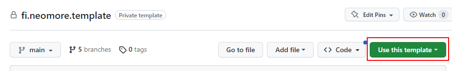

# Neomore Template

Neomore CF Template Fiori application

## Workshop Chat app

This app has been turned into the minimal **Workshop Chat** participant app. It is a
single page that talks to the CAP `WorkshopHubService` over **OData V4**
(`/workshop-hub`), which in turn forwards to the [Workshop Hub](../workshop-hub/).

- On first load a mandatory **Register** dialog asks for a team name and an optional
  team avatar (uploaded via the `uploadAvatar` action). The registration
  (`participantId` + `displayName`) is kept in `sessionStorage`, so a reload skips the
  dialog for the rest of the session.
- The **Chat** page lists `chat.message.sent` events (sender name + avatar) and lets you
  post new messages via the `sendChatMessage` action. A **heartbeat** button in the page
  header sends an anonymous `heartbeat` on demand.

Key files: [`webapp/view/App.view.xml`](webapp/view/App.view.xml),
[`webapp/view/fragment/RegisterDialog.fragment.xml`](webapp/view/fragment/RegisterDialog.fragment.xml),
[`webapp/controller/App.controller.js`](webapp/controller/App.controller.js),
[`webapp/manifest.json`](webapp/manifest.json).

### Running the chat app locally

1. Start the Hub (`workshop-hub/`, port `8080`) and CAP (`cap/`, `npx cds-serve`, port `4004`).
2. From this folder: `npm install`, then `npm run start-noflp` (serves on port `8081`).
   The dev server proxies `/workshop-hub` to `http://localhost:4004` (see `ui5.yaml`).

The sections below are the original Fiori freestyle template documentation.

### Application Details
|                                 |                                  |
| ------------------------------- | -------------------------------- |
| **App Generator**               | @sap/generator-fiori-freestyle   |
| **App Generator Version**       | 1.13.6                           |
| **Application Title**           | Template Application             |


# **NOTE!**

This version of template requires **Node version `>=20`** to run. Minimum SAPUI5 version is also raised to **`1.120`** so if you need to use older SAPUI5 version, please use the `Before UI5 "v2" template` release tagged with `v1.0.0`.


# Pre-requisites:

1. Active [NodeJS](https://nodejs.org) LTS (Long Term Support) version (>=20) and associated supported NPM version.

If you want to build and deploy application straight from your local computer:

1. [CF cli](https://docs.cloudfoundry.org/cf-cli/install-go-cli.html)
2. CF cli [multiapps plugin](https://github.com/cloudfoundry/multiapps-cli-plugin)
3. make ([chocolatey](https://chocolatey.org/install): choco install make)

# Initialization
1. Export the code one of the following ways:
    - Clone the repository, delete .git folder and initialize new git repository (```git init```)
    - Download the code as zip and extract it
    - Create new repository using this as template
    
2. ```npm i``` to install dependencies
3. Initialize project namespace ```node ./hooks/init-project.js -t 'new.project.name'```
    - -s or --source can be used to change project from already once changed name (defaulted to fi.neomore.template)
    - -t or --target is mandatory parameter to tell script how to name project, use dot separated format (new.project.name)
4. When using template for actual project, after basic initialization you should:
    - remove unnecessary information from this README.md file
    - remove unnecessary hooks
    - remove scripts that you are not using from package.json

# Development
1. ```npm i``` to install dependencies
2. ```npm run start``` to run application
    - Runs application with ui5.yaml-settings. Alternatives:
        - ```npm run start-local``` - ui5-local.yaml
        - ```npm run start-mockserver``` - ui5-mockserver.yaml (See Mockserver)
        - ```npm run start-localhost``` - ui5-localhost.yaml (See Local Approuter)

## Mockserver (\webapp\test\localService)
- You can download (or edit) your application services metadata xml in to the folder (name file with service name "ZWM_COMMON_SRV.xml").
- Edit mockserver.js line 7 to include your services ```var aMockServers = ['ZWM_COMMON_SRV'];```
- Add new folder to \webapp\test\localService\mockdata\{ZWM_COMMON_SRV}, in this folder you can add custom .json files that have the data you want, if the auto-generated ones are not sufficient enough.

## Recommendations for development
You can make development easier with [VSCode](https://code.visualstudio.com/) by adding extensions that enhance your development process and mitigate amount of bugs in your code
- [SAPUI5 Extension](https://marketplace.visualstudio.com/items?itemName=iljapostnovs.ui5plugin)
    - Auto-complete on SAPUI5 properties, functions etc.
    - Intellisense
        - Functions can be documented with JSDoc comments or alternatively using hungarian notation
            - That way intellisense can tell you expected parameters and validate that types are used correctly
    - Automatic templates
    - More can be checked from the extension documentation
- [ESLint](https://marketplace.visualstudio.com/items?itemName=dbaeumer.vscode-eslint)
    - Static code checks and highlighting

# Unit testing
It is recommended to add unit tests when ever feasible with as much coverage as possible to ensure regression free development.
We use [karma runner](https://karma-runner.github.io/latest/index.html) to run our tests, and we use [QUnit](https://sapui5.hana.ondemand.com/sdk/#/topic/09d145cd86ee4f8e9d08715f1b364c51.html) to describe them.


## Test development
Unit tests are located in `webapp/test/unit`.

They can be run using `npm run test` command for single run, or `npm run test:watch` for when you want to run the tests after each save.

You can also run `npm run test:coverage` to see how well certain files (karma runner checks for imported files in the spec files) are covered (functions, lines and branching conditions).

To add new tests you need to create a new test file (you can copy existing one) and import it in `webapp/test/unit/AllTests.js`
in order for them to run.


When you're developing new cases you can run single spec file using `npm run test -- --spec=unitTest/{path}`


# Build & Deployment

1. ```cf api https://api.cf.{target datacenter for example 'eu10'}.hana.ondemand.com```
2. ```cf login```
    - Login with your S-id and password
    - Select correct organization and space
3. (optional) if already logged in, you can change the target with ```cf target -o {organization name} -s {space name}```
4. ```npm run build-and-deploy```
    - This task will build the application, create Multi Target Application Resource file and deploy it to targeted space
    - Steps:
        - ```npm run build:mta```
        - ```npm run deploy:mta```
    - If you want, you can add additional tasks that target different systems, to make it easier, for example create new script in package.json
        - ```"build-and-deploy:test": "cf target -o test_organization_name -s test_space_name && npm run build-and-deploy"``` that would ensure that you are targeting correct system when deploying to test system

## Deployment through CTMS (Cloud Trasport Management Service)

1. Build the application ```npm run build:mta```
2. Maintain ```ctms-setting.json``` file under ```.\hooks``` folder
    - Template can be found from ```.\hooks\ctms-setting-template.json```
    - ```ctms-setting.json``` is ignored by git, as it contains sensitive information (client id, client secret)
2. Run ```node .\hooks\ctms-upload.js -d '{description of transport}'```
    - This will upload the application to CTMS
    - Transport description should be descriptive so it is easy to find in the transport list later on as the CTMS filtering options are limited
        - JIRA ticket number or similar code of the development (to find specific transport)
        - Application name (to find all transports of the application to check that there are no earlier changes that are not deployed yet)
        - Version number of the application
        - For example: ```CHG00001: New functionality (fineomoretemplate 1.0.0)```

## Versioning

```.\hooks\version-update.js``` script can be used to update the version number of the application.
- For basic patch update (+0.0.1) there is script ```npm run version-update```
- Minor version update (+0.1.0) can be run ```npm run version-update --updateVersion=minor```
- Major version update (+1.0.0) can be run ```npm run version-update --updateVersion=major```

# Author

Neomore Consulting Oy
