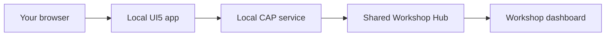

# Workshop Participant Guide

## Your Goal

In this workshop, you will complete a local UI5 and CAP chat application that
connects to the shared Workshop Hub. The Hub watches real application behavior and
marks six tasks complete:

| Order | Hub task | What you will do | Time |
| --- | --- | --- | --- |
| 1 | `register` | Register your team | 5 min |
| 2 | `heartbeat` | Send an identified heartbeat | 8 min |
| 3 | `chat` | Send a one-line message | 5 min |
| 4 | `multiline-message` | Preserve and display line breaks | 10 min |
| 5 | `feature-avatar` | Upload your team avatar | 12 min |
| 6 | `reply-message` | Reply to an existing message | 15 min |

Allow the final 5 minutes for validation. When you finish, the source in `cap/`
and `ui5/` should behave like the reference implementation in `complete/cap/` and
`complete/ui5/`.

## How The App Works



Always work in the root `cap/` and `ui5/` folders. Do not modify
`workshop-hub/`; it is the external system that verifies your work. Use
`complete/` works as a completed code example for later reference.

The Hub marks tasks complete from valid requests.

## Working With Copilot

For each task:

1. Reproduce the problem before changing code.
2. Collect runtime, code, and contract evidence.
3. Define the acceptance criteria and validation plan.
4. Draft your own prompt from that evidence.
5. Compare your draft with the example, then improve it.
6. Ask for a focused answer or the smallest focused change.
7. Review the diff instead of accepting it blindly.
8. Run the planned checks and confirm completion on the Workshop Hub dashboard.
9. Commit the verified change before starting the next task.

### Build A Prompt From What You Find

Do not guess the fix. First collect a few facts about the problem, then use those
facts in your prompt.

| What to find out | What to do | Add this to your prompt |
| --- | --- | --- |
| What happened? | Try the task and note what happened, what should have happened, and any error message | **Observed** and **Expected** |
| Where does it happen? | Follow the action through the relevant UI, CAP, and Hub code | The files and functions to inspect |
| What must keep working? | Check the existing inputs, tests, and working behavior | **Task** and **Constraints** |
| Can you give an example? | Write down a sample input and the result you expect | **Examples** |
| How will you check the fix? | Choose the smallest useful test or build command, plus one manual check | **Validate** |

Use **Ask mode** for questions, brainstorming, and tracing behavior without editing.
Use **Agent mode** for implementation that requires file edits and tools, especially
across multiple files. For a complex or cross-cutting change, use **Plan** first,
review the plan, and then implement it in Agent mode. If the requirements are still
ambiguous, tell Copilot to ask clarifying questions before proceeding.

Open the relevant files and close unrelated files before prompting. In VS Code, you
can explicitly add context by referencing a file, folder, or symbol with the chat
context controls such as `#<file>`, `#<folder>`, or `#<symbol>`.

Most prompts only need these parts:

```text
<What you want and what is happening now>
<Relevant files or functions>
<Important behavior that must not break>
<How Copilot should check the result>
```

Treat this as a checklist, not a form. Include only useful details. Add an example
or exact error when it helps remove ambiguity.

Start with the goal, then add the details. Use facts you observed, label guesses, and
ask Copilot to verify them. Name the relevant files or functions and include exact
errors. Keep each prompt focused on one task.

Correct Copilot early if needed, and start a new chat for unrelated work. Review every
diff and run the requested checks. At each Draft Your Prompt checkpoint, **write
your prompt before reading the example**; use the example only to compare or get unstuck.

### Official Guidance

This method applies the following official documentation:

- [Prompt engineering for GitHub Copilot Chat](https://docs.github.com/en/copilot/concepts/prompting/prompt-engineering)
- [Best practices for using GitHub Copilot](https://docs.github.com/en/copilot/get-started/best-practices)
- [Best practices for using AI in VS Code](https://code.visualstudio.com/docs/agents/best-practices)
- [Build with agents in VS Code](https://code.visualstudio.com/docs/agents/overview)

The prompts below are starting points. Add error messages or observed behavior
when you have them.

### Create A Feature Branch

Create one feature branch for the whole workshop before Task 1. Use a short team
name without spaces in the branch name:

```bash
cd "$(git rev-parse --show-toplevel)"
git status
git switch -c feature/workshop-chat-team-red
```

Replace `team-red` with your team name. Start from a clean working tree, and never
commit the workshop password or other credentials.

After each coding task passes its automated checks and the Hub marks it complete,
return to the repository root, then review and commit only that task's files:

```bash
cd "$(git rev-parse --show-toplevel)"
git status
git diff
git add -p cap/ ui5/
git diff --cached
git commit -m "fix: describe the completed behavior"
```

The `-p` option lets you inspect each change before staging it. Do not use
`git add .` without reviewing what it includes. Tasks 1 and 3 are behavior checks
with no source changes, so verify that the tree is clean instead of creating an
empty commit.

## Before You Start

Get the Hub URL and workshop password from the facilitator, then export them in
the terminal where you will start the app:

```bash
export WORKSHOP_HUB_URL="https://neomore-workshop-hub.politegrass-3dc51b12.northeurope.azurecontainerapps.io"
export WORKSHOP_PASSWORD="<shared-workshop-password>"
```

Check that the Hub is available:

```bash
curl -fsS "$WORKSHOP_HUB_URL/actuator/health"
curl -fsS "$WORKSHOP_HUB_URL/tasks"
```

Start your local UI5 and CAP containers. The first startup can take several minutes:

```bash
cd ui5
docker compose up --build
```

Open `http://localhost:8081/index.html`. Keep the shared Workshop Hub dashboard
open so you can see each task complete:

https://neomore-workshop-hub.politegrass-3dc51b12.northeurope.azurecontainerapps.io/dashboard/index.html

## Task 1: Register Your Team

This task confirms that your browser, UI5 app, CAP service, and shared Hub can
communicate. No code change is required.

### Steps

1. Open `http://localhost:8081`.
2. Enter a recognizable team name and the workshop password.
3. Leave the avatar empty for now.
4. Choose **Join Workshop**.
5. Confirm that your team name appears in the application header.
6. Find your team on the shared dashboard.

### Investigate

1. In `ui5/webapp/controller/App.controller.js`, inspect `onJoin`,
   `_applyRegistered`, and `_persistParticipant`.
2. In `cap/srv/workshop-service.js`, inspect `doRegister` and the in-memory
   connection state.
3. In `cap/srv/lib/hub-client.js`, inspect `registerParticipant`.

### Expected Result

- The activity feed shows a `participant.connected` event.
- The Hub marks `register` complete for your team.
- The application stores the returned participant ID for later requests.

### Validation Plan

This is an explanation task, so no code check is needed. A complete answer must
identify where the participant ID is stored and how later actions reuse it.

### Draft Your Prompt

Before reading the example, write an Ask prompt using the runtime observations
above. Name the registration path to inspect, request an explanation, and prohibit
code changes.

### Example Prompt

**Mode: Ask**

```text
Trace registration from the UI5 join dialog through CAP to the Workshop Hub. Explain
where the participant ID is stored and how later actions reuse it. Inspect
App.controller.js, workshop-service.js, and hub-client.js. Do not change code.
```

If registration fails, check `WORKSHOP_HUB_URL`, `WORKSHOP_PASSWORD`, and the
container logs before editing source code.

### Git Checkpoint

Task 1 requires no source change. Confirm that registration is complete and the
working tree is still clean:

```bash
cd "$(git rev-parse --show-toplevel)"
git status --short
```

## Task 2: Send An Identified Heartbeat

The heart button in the top right corner sends a heartbeat to the Hub. The request
currently reaches the Hub, but it is anonymous. Update CAP so the Hub can identify
your team.

### Reproduce The Problem

1. Choose the heart button in the application header.
2. Watch the dashboard pulse.
3. Confirm that the `heartbeat` task remains incomplete or the activity is
   anonymous.

### Investigate

1. Open `cap/srv/workshop-service.js` and find the heartbeat action.
2. Locate the in-memory connection state populated during registration.
3. Open `cap/srv/lib/hub-client.js` and inspect `sendHeartbeat`.
4. Confirm that the Hub client accepts an optional participant ID.

### Expected Result

- CAP sends `POST /heartbeat` with the registered participant ID.
- The heartbeat activity names your team.
- The Hub marks `heartbeat` complete exactly once.
- A heartbeat before registration still returns a useful error.

### Validation Plan

After the change, run the CAP tests, rebuild the local stack, send another heartbeat,
and confirm the named activity and completed task on the dashboard.

### Draft Your Prompt

Before reading the example, turn the reproduced symptom, inspected function
signature, existing connection state, expected result, and validation plan into one
bounded Agent prompt.

### Example Prompt

**Mode: Agent**

```text
The heartbeat reaches the Hub but remains anonymous. In
cap/srv/workshop-service.js, pass the registered participant ID to the existing
sendHeartbeat call in cap/srv/lib/hub-client.js. Preserve anonymous client support
and the pre-registration error. Run `cd cap && npm test` after the change.
```

### Run Validation

```bash
cd cap
npm test
```

Inspect the generated diff and continue only if it is focused and the tests pass.

In the terminal running Docker Compose from `ui5/`, press `Ctrl+C`, then rebuild:

```bash
docker compose up --build
```

Wait until `ui5-cap-1` emits an OData log containing
`"host":"localhost:4004"`. Refresh the existing browser tab, choose the heart
button, and check the dashboard against the expected result.

### Git Checkpoint

After the CAP tests pass and the Hub marks `heartbeat` complete:

```bash
cd "$(git rev-parse --show-toplevel)"
git add -p cap/
git diff --cached
git commit -m "fix: identify workshop heartbeat"
```

## Task 3: Send Your First Message

Ordinary one-line chat already works. Use it as a regression check before changing
message handling.

### Steps

1. Enter a short one-line greeting.
2. Send the message.
3. Confirm that it appears in your chatboard and on another participant's screen.
4. Check the shared dashboard.

### Investigate

1. In `ui5/webapp/controller/App.controller.js`, inspect `onSend` and the existing
   action invocation.
2. In `cap/srv/workshop-service.js`, inspect the `sendChatMessage` handler,
   `chatFields`, and `sendEvent`.
3. In `cap/srv/lib/hub-client.js`, inspect `publishEvent`.
4. In `workshop-hub/src/main/java/com/neomore/workshophub/service/WorkshopService.java`,
   inspect the `CHAT_MESSAGE_SENT` validation without modifying it.

### Expected Result

- The Hub receives a non-empty `chat.message.sent` event.
- The Hub marks `chat` complete exactly once.
- Your message remains visible after the feed refreshes.

### Validation Plan

This is an explanation and regression task. The answer must identify the payload at
each boundary and the Hub validation rule; the existing one-line behavior must remain
unchanged.

### Draft Your Prompt

Before reading the example, write an Ask prompt that names the UI5 controller, CAP
action, and Hub boundary. Request an explanation only and prohibit code changes.

### Example Prompt

**Mode: Ask**

```text
Trace one chat message from `onSend` in App.controller.js through the CAP
sendChatMessage action and into the Workshop Hub. Explain the payload at each
boundary and the rule that completes the chat task. Do not change code.
```

Do not continue until `register`, `heartbeat`, and `chat` are complete.

### Git Checkpoint

Task 3 requires no source change. Confirm that the previous commit left the working
tree clean:

```bash
cd "$(git rev-parse --show-toplevel)"
git status --short
```

## Task 4: Preserve A Multiline Message

The starter replaces line breaks with spaces and renders the result as one line.
Fix both transport and display behavior.

### Reproduce The Problem

1. Enter two non-empty lines in the message composer.
2. Send the message.
3. Confirm that the lines are flattened and `multiline-message` remains
   incomplete.

### Investigate

1. Open `ui5/webapp/util/chat.js` and inspect `normalizeMessage`.
2. Open `ui5/webapp/test/unit/util/chat.js` and inspect its normalization tests.
3. Open `ui5/webapp/view/App.view.xml` and find the message text control.
4. Open `ui5/webapp/css/styles.less` and find the message style placeholder.

### Expected Result

- `normalizeMessage` trims only outer whitespace.
- The payload contains a real line separator, not the characters `\` and `n`.
- The chatboard displays the message on separate lines.
- Long content still wraps inside the message area.
- The Hub marks `multiline-message` complete.

### Validation Plan

Run the focused UI5 tests and build. Then send two real lines and confirm that they
remain separate. Also confirm that typing the literal characters `\n` does not count
as a multiline message.

### Draft Your Prompt

Before reading the example, combine the observed transport and rendering symptoms
with the inspected utility, test, view, and style files. Include the real-line-break
and literal-`\n` examples, boundaries, and validation commands.

### Example Prompt

**Mode: Agent**

```text
Preserve real line breaks in UI5 chat messages. Update normalizeMessage and its
focused QUnit test so only outer whitespace is trimmed, then update App.view.xml and
styles.less to display line breaks while wrapping long words. Keep literal `\n` as
ordinary text and do not change CAP or Hub contracts. Run `npm test` and
`npm run build` from `ui5/`.
```

### Run Validation

```bash
cd ui5
npm test
npm run build
```

Since this is a UI5-only change, no container restart is needed. Send the two
examples from the validation plan and check the expected result.

### Git Checkpoint

After the UI5 tests and build pass and the Hub marks `multiline-message` complete:

```bash
cd "$(git rev-parse --show-toplevel)"
git add -p ui5/
git diff --cached
git commit -m "fix: preserve multiline chat messages"
```

## Task 5: Upload Your Team Avatar

The starter previews your selected image but does not upload it. Connect the
existing normalized data URL to the CAP upload action.

### Reproduce The Problem

1. Reopen your team profile.
2. Select a PNG, JPEG, or WEBP image.
3. Save the profile by choosing **Join Workshop**.
4. Refresh the page.
5. Confirm that the picture is unchanged and `feature-avatar` remains
   incomplete.

### Investigate

1. Open `ui5/webapp/controller/App.controller.js`.
2. Find `_maybeUploadAvatar` and the pending avatar data URL.
3. Find the existing `_invokeAction` helper and `/uploadAvatar(...)` action.
4. Open `cap/srv/workshop-service.cds` to confirm that the action expects base64
   image content.

### Expected Result

- UI5 sends only the base64 image content, without the data-URL prefix.
- CAP converts and forwards the image bytes for your participant ID.
- The avatar is loaded from the Hub after refresh.
- The Hub marks `feature-avatar` complete.

If the upload returns HTTP `413`, choose a smaller image and confirm that the
existing client-side normalization is still being used.

### Validation Plan

Run UI5 lint and the build. Save the profile again, refresh the page, reopen the
profile editor, and confirm that the avatar persists and the Hub task completes.

### Draft Your Prompt

Before reading the example, use the observed preview-only behavior, pending data URL,
CAP action contract, success-state requirement, and validation plan. Include one
concrete data-URL-to-base64 example.

### Example Prompt

**Mode: Agent**

```text
Complete `_maybeUploadAvatar` in App.controller.js. Remove only the data-URL prefix
and pass the remaining base64 content to the existing `/uploadAvatar(...)` action.
Mark the avatar uploaded only after success and preserve current normalization and
error handling. Run `npm run lint` and `npm run build` from `ui5/`.
```

### Run Validation

```bash
cd ui5
npm run lint
npm run build
```

Perform the manual refresh and persistence checks from the validation plan.

### Git Checkpoint

After lint and the build pass and the Hub marks `feature-avatar` complete:

```bash
cd "$(git rev-parse --show-toplevel)"
git add -p ui5/
git diff --cached
git commit -m "feat: upload participant avatar"
```

## Task 6: Reply To A Message

The starter displays a reply preview, but it loses the selected event ID. Preserve
that ID in UI5 and forward it through CAP as event metadata.

### Reproduce The Problem

1. Choose **Reply** on an existing chat message.
2. Enter and send a response.
3. Confirm that the reply is sent as an ordinary message and `reply-message`
   remains incomplete.

### Investigate

1. In `ui5/webapp/controller/App.controller.js`, inspect `onReply`, `onSend`, and
   the reply cleanup behavior.
2. Confirm that `onSend` already supports an optional `replyToEventId`.
3. In `cap/srv/workshop-service.js`, inspect `chatFields` and event construction.
4. In `cap/test/hub-contract.test.js`, find the ordinary chat contract test.

### Expected Result

- UI5 retains the selected event ID until send succeeds or reply is canceled.
- CAP sends `{ "replyToEventId": <id> }` as event metadata only for replies.
- CAP does not forward client-authored copies of the original sender or message.
- The Hub enriches the reply with trusted context from the referenced chat event.
- Canceling reply leaves ordinary chat unchanged.
- The Hub marks `reply-message` complete.

### Validation Plan

Run the CAP tests, UI5 lint, and UI5 build. Rebuild the containers, send a reply,
then cancel a second reply and send an ordinary message. Confirm both paths on the
dashboard.

### Draft Your Prompt

Before reading the example, combine the UI5 state evidence, CAP metadata boundary,
ordinary-chat regression case, focused contract test, and full validation plan. This
change crosses UI5 and CAP, so plan it before implementation.

### Example Prompt

**Mode: Plan, then Agent**

Submit the prompt in Plan mode. Review the proposed files and checks, then hand the
approved plan to Agent mode for implementation.

```text
The reply preview works, but the selected event ID is lost. Plan the smallest changes
to App.controller.js, CAP `chatFields`, and the focused contract test so replies send
only `metadata.replyToEventId`. Preserve ordinary chat and reply cleanup; do not
forward client-authored sender or message copies. Validate with CAP tests, UI5 lint,
and the UI5 build. After I approve the plan, implement it.
```

### Run Validation

```bash
cd cap
npm test

cd ../ui5
npm run lint
npm run build
```

In the terminal running Docker Compose from `ui5/`, press `Ctrl+C`, then rebuild:

```bash
docker compose up --build
```

Wait for both services to restart, refresh the chat page, and allow the saved
connection to restore automatically. Perform both manual message paths from the
validation plan and compare them with the expected result.

### Git Checkpoint

After the CAP and UI5 checks pass and the Hub marks `reply-message` complete:

```bash
cd "$(git rev-parse --show-toplevel)"
git add -p cap/ ui5/
git diff --cached
git commit -m "feat: propagate chat reply metadata"
```

## Final Validation

Your team should now show `6/6` on the Workshop Hub dashboard.

### Behavior Check

1. Send another heartbeat and confirm there is no duplicate completion.
2. Send a one-line message and confirm it still works.
3. Send two real lines and confirm they remain separate.
4. Confirm that typing a literal `\n` does not complete the multiline task.
5. Refresh and confirm that your avatar still loads.
6. Reply to a message, then cancel a reply and send an ordinary message.

### Thank You

Thank you for participating in the Workshop Hub. This was the first workshop in the
AI series. The next workshop will focus on Office 365.

Please leave some anonymous feedback at: https://forms.cloud.microsoft/e/kB1xBajVeG


## Recovery: Local Hub

Use this only when the facilitator confirms that the shared Hub is unavailable.
Start a local Hub in one terminal:

```bash
cd workshop-hub
WORKSHOP_PASSWORD=local docker compose up --build
```

Start your starter app in another terminal:

```bash
cd ui5
WORKSHOP_HUB_URL="http://host.docker.internal:8080" \
WORKSHOP_PASSWORD="local" \
docker compose up --build
```

Open the local dashboard at `http://localhost:8080/dashboard/index.html` and use
the password `local`. Your progress will be isolated from the shared room.