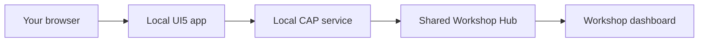

# Workshop Participant Guide

## Your Goal

In this workshop, you will complete a local UI5 and CAP chat application that
connects to the shared Workshop Hub. The Hub watches real application behavior and
marks six tasks complete:

| Order | Hub task | What you will do | Time |
| --- | --- | --- | --- |
| 1 | `register` | Register your team | 5 min |
| 2 | `heartbeat` | Send an identified heartbeat | 8 min |
| 3 | `chat` | Send a one-line message | 5 min |
| 4 | `multiline-message` | Preserve and display line breaks | 10 min |
| 5 | `feature-avatar` | Upload your team avatar | 12 min |
| 6 | `reply-message` | Reply to an existing message | 15 min |

Allow the final 5 minutes for validation. When you finish, the source in `cap/`
and `ui5/` should behave like the reference implementation in `complete/cap/` and
`complete/ui5/`.

## How The App Works



Always work in the root `cap/` and `ui5/` folders. Do not modify
`workshop-hub/`; it is the external system that verifies your work. Use
`complete/` only as a recovery reference after you have investigated a task.

The Hub marks tasks complete from valid requests. Do not send your own
`task.completed` events.

## Before You Start

Get the Hub URL and workshop password from the facilitator, then export them in
the terminal where you will start the app:

```bash
export WORKSHOP_HUB_URL="https://neomore-workshop-hub.politegrass-3dc51b12.northeurope.azurecontainerapps.io"
export WORKSHOP_PASSWORD="<shared-workshop-password>"
```

Check that the Hub is available:

```bash
curl -fsS "$WORKSHOP_HUB_URL/actuator/health"
curl -fsS "$WORKSHOP_HUB_URL/tasks"
```

Start your local UI5 and CAP containers:

```bash
cd ui5
docker compose up --build
```

Open `http://localhost:8081`. Keep the shared Workshop Hub dashboard open so you
can see each task complete:

https://neomore-workshop-hub.politegrass-3dc51b12.northeurope.azurecontainerapps.io/dashboard/index.html

## Working With Copilot

For each task:

1. Reproduce the problem before changing code.
2. Give Copilot the symptom, relevant files, and acceptance criteria.
3. Ask for the smallest focused change.
4. Review the diff instead of accepting it blindly.
5. Run the suggested checks.
6. Confirm completion on the Workshop Hub dashboard.

The prompts below are starting points. Add error messages or observed behavior
when you have them.

## Task 1: Register Your Team

This task confirms that your browser, UI5 app, CAP service, and shared Hub can
communicate. No code change is required.

### Steps

1. Open `http://localhost:8081`.
2. Enter a recognizable team name and the workshop password.
3. Leave the avatar empty for now.
4. Choose **Join Workshop**.
5. Confirm that your team name appears in the application header.
6. Find your team on the shared dashboard.

### Expected Result

- The activity feed shows a `participant.connected` event.
- The Hub marks `register` complete for your team.
- The application stores the returned participant ID for later requests.

### Example Prompt

```text
Trace registration from the UI5 join dialog through the local CAP service to the
Workshop Hub. Explain where the returned participant ID is stored and how later
actions use it. Do not change code.
```

If registration fails, check `WORKSHOP_HUB_URL`, `WORKSHOP_PASSWORD`, and the
container logs before editing source code.

## Task 2: Send An Identified Heartbeat

The heart button currently reaches the Hub, but the request is anonymous. Update
CAP so the Hub can identify your team.

### Reproduce The Problem

1. Choose the heart button in the application header.
2. Watch the dashboard pulse.
3. Confirm that the `heartbeat` task remains incomplete or the activity is
   anonymous.

### Investigate

1. Open `cap/srv/workshop-service.js` and find the heartbeat action.
2. Locate the in-memory connection state populated during registration.
3. Open `cap/srv/lib/hub-client.js` and inspect `sendHeartbeat`.
4. Confirm that the Hub client accepts an optional participant ID.

### Example Prompt

```text
The CAP heartbeat reaches the Workshop Hub but remains anonymous. Inspect
cap/srv/workshop-service.js and cap/srv/lib/hub-client.js. Pass the registered
participant ID to the existing Hub client without changing anonymous Hub support.
Keep the pre-registration error and run the CAP tests after the change.
```

### Validate

```bash
cd cap
npm test
```

Restart or rebuild the local stack if needed, then choose the heart button again.

### Expected Result

- CAP sends `POST /heartbeat` with the registered participant ID.
- The heartbeat activity names your team.
- The Hub marks `heartbeat` complete exactly once.
- A heartbeat before registration still returns a useful error.

## Task 3: Send Your First Message

Ordinary one-line chat already works. Use it as a regression check before changing
message handling.

### Steps

1. Enter a short one-line greeting.
2. Send the message.
3. Confirm that it appears in your chatboard and on another participant's screen.
4. Check the shared dashboard.

### Expected Result

- The Hub receives a non-empty `chat.message.sent` event.
- The Hub marks `chat` complete exactly once.
- Your message remains visible after the feed refreshes.

### Example Prompt

```text
Trace one chat message from ui5/webapp/controller/App.controller.js through the
CAP sendChatMessage action and into the Workshop Hub event request. Explain the
payload and validation path. Do not change code.
```

Do not continue until `register`, `heartbeat`, and `chat` are complete.

## Task 4: Preserve A Multiline Message

The starter replaces line breaks with spaces and renders the result as one line.
Fix both transport and display behavior.

### Reproduce The Problem

1. Enter two non-empty lines in the message composer.
2. Send the message.
3. Confirm that the lines are flattened and `multiline-message` remains
   incomplete.

### Investigate

1. Open `ui5/webapp/util/chat.js` and inspect `normalizeMessage`.
2. Open `ui5/webapp/test/unit/util/chat.js` and inspect its normalization tests.
3. Open `ui5/webapp/view/App.view.xml` and find the message text control.
4. Open `ui5/webapp/css/styles.less` and find the message style placeholder.

### Example Prompt

```text
Preserve multiline chat messages in the UI5 starter. Keep trimming whitespace at
the beginning and end, but retain internal CR/LF characters. Update the focused
QUnit test, render preserved whitespace in App.view.xml, and add the minimal LESS
needed to preserve line breaks while wrapping long words. Run the UI5 tests and
build. Do not change the CAP or Hub contracts.
```

### Validate

```bash
cd ui5
npm test
npm run build
```

Send a new message with at least two non-empty lines.

### Expected Result

- `normalizeMessage` trims only outer whitespace.
- The payload contains a real line separator, not the characters `\` and `n`.
- The chatboard displays the message on separate lines.
- Long content still wraps inside the message area.
- The Hub marks `multiline-message` complete.

## Task 5: Upload Your Team Avatar

The starter previews your selected image but does not upload it. Connect the
existing normalized data URL to the CAP upload action.

### Reproduce The Problem

1. Reopen your team profile.
2. Select a PNG, JPEG, or WEBP image.
3. Save the profile.
4. Confirm that the preview changes locally but `feature-avatar` remains
   incomplete.

### Investigate

1. Open `ui5/webapp/controller/App.controller.js`.
2. Find `_maybeUploadAvatar` and the pending avatar data URL.
3. Find the existing `_invokeAction` helper and `/uploadAvatar(...)` action.
4. Open `cap/srv/workshop-service.cds` to confirm that the action expects base64
   image content.

### Example Prompt

```text
The UI5 avatar preview works, but the image never reaches CAP. In
ui5/webapp/controller/App.controller.js, complete _maybeUploadAvatar by removing
only the data-URL prefix and passing the remaining base64 content as image to the
existing /uploadAvatar(...) action. Mark the avatar uploaded only after success.
Preserve the current normalization and error handling, then run the UI5 build.
```

### Validate

```bash
cd ui5
npm run lint
npm run build
```

Save the profile again, refresh the page, and reopen the profile editor.

### Expected Result

- UI5 sends only the base64 image content, without the data-URL prefix.
- CAP converts and forwards the image bytes for your participant ID.
- The avatar is loaded from the Hub after refresh.
- The Hub marks `feature-avatar` complete.

If the upload returns HTTP `413`, choose a smaller image and confirm that the
existing client-side normalization is still being used.

## Task 6: Reply To A Message

The starter displays a reply preview, but it loses the selected event ID. Preserve
that ID in UI5 and forward it through CAP as event metadata.

### Reproduce The Problem

1. Choose **Reply** on an existing chat message.
2. Enter and send a response.
3. Confirm that the reply is sent as an ordinary message and `reply-message`
   remains incomplete.

### Investigate

1. In `ui5/webapp/controller/App.controller.js`, inspect `onReply`, `onSend`, and
   the reply cleanup behavior.
2. Confirm that `onSend` already supports an optional `replyToEventId`.
3. In `cap/srv/workshop-service.js`, inspect `chatFields` and event construction.
4. In `cap/test/hub-contract.test.js`, find the ordinary chat contract test.

### Example Prompt

```text
Complete reply propagation with the smallest changes. In the UI5 controller,
retain the selected feed item's id as replyToEventId. In CAP chatFields, include
metadata.replyToEventId only when the optional value is present. Add a focused CAP
test proving that a reply forwards only the target event ID. Preserve ordinary
chat and existing reply cleanup, then run CAP tests and the UI5 build.
```

### Validate

```bash
cd cap
npm test

cd ../ui5
npm run lint
npm run build
```

Reply to an existing message again. Then cancel a second reply and send an ordinary
message to check both paths.

### Expected Result

- UI5 retains the selected event ID until send succeeds or reply is canceled.
- CAP sends `{ "replyToEventId": <id> }` as event metadata only for replies.
- CAP does not forward client-authored copies of the original sender or message.
- The Hub enriches the reply with trusted context from the referenced chat event.
- Canceling reply leaves ordinary chat unchanged.
- The Hub marks `reply-message` complete.

## Final Validation

Your team should now show `6/6` on the Workshop Hub dashboard.

### Behavior Check

1. Send another heartbeat and confirm there is no duplicate completion.
2. Send a one-line message and confirm it still works.
3. Send two real lines and confirm they remain separate.
4. Confirm that typing a literal `\n` does not complete the multiline task.
5. Refresh and confirm that your avatar still loads.
6. Reply to a message, then cancel a reply and send an ordinary message.

### Automated Checks

```bash
cd cap
npm test

cd ../ui5
npm run lint
npm test
npm run build
```

### Compare With The Completed Reference

The finished source should match the behavior and focused implementation in these
reference files:

| Your file | Completed reference |
| --- | --- |
| `cap/srv/workshop-service.js` | `complete/cap/srv/workshop-service.js` |
| `cap/test/hub-contract.test.js` | `complete/cap/test/hub-contract.test.js` |
| `ui5/webapp/controller/App.controller.js` | `complete/ui5/webapp/controller/App.controller.js` |
| `ui5/webapp/util/chat.js` | `complete/ui5/webapp/util/chat.js` |
| `ui5/webapp/test/unit/util/chat.js` | `complete/ui5/webapp/test/unit/util/chat.js` |
| `ui5/webapp/view/App.view.xml` | `complete/ui5/webapp/view/App.view.xml` |
| `ui5/webapp/css/styles.less` | `complete/ui5/webapp/css/styles.less` |
| `ui5/webapp/css/styles.css` (generated by the build) | `complete/ui5/webapp/css/styles.css` |

Use a focused diff if a task behaves differently:

```bash
diff -u cap/srv/workshop-service.js complete/cap/srv/workshop-service.js
diff -u ui5/webapp/controller/App.controller.js complete/ui5/webapp/controller/App.controller.js
```

Do not replace whole starter folders with `complete/`. Review each remaining
difference and make sure you understand why it is needed.

## Recovery: Local Hub

Use this only when the facilitator confirms that the shared Hub is unavailable.
Start a local Hub in one terminal:

```bash
cd workshop-hub
WORKSHOP_PASSWORD=local docker compose up --build
```

Start your starter app in another terminal:

```bash
cd ui5
WORKSHOP_HUB_URL="http://host.docker.internal:8080" \
WORKSHOP_PASSWORD="local" \
docker compose up --build
```

Open the local dashboard at `http://localhost:8080/dashboard/index.html` and use
the password `local`. Your progress will be isolated from the shared room.